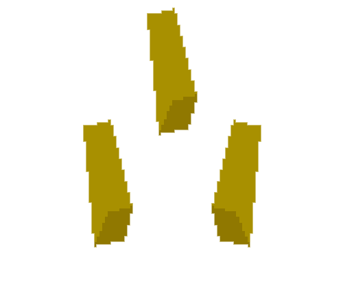

### Hello and welcome!
My projects are listed below. I'm always willing to make something cool. I like video games, web development, coffee, and the occasional meme.

UX is cool too!

### Contact me:

#### Front end

  
  
  
  

#### Back end

  
  
  
  
  

#### Utils

  
  
  
  
  
  

  

